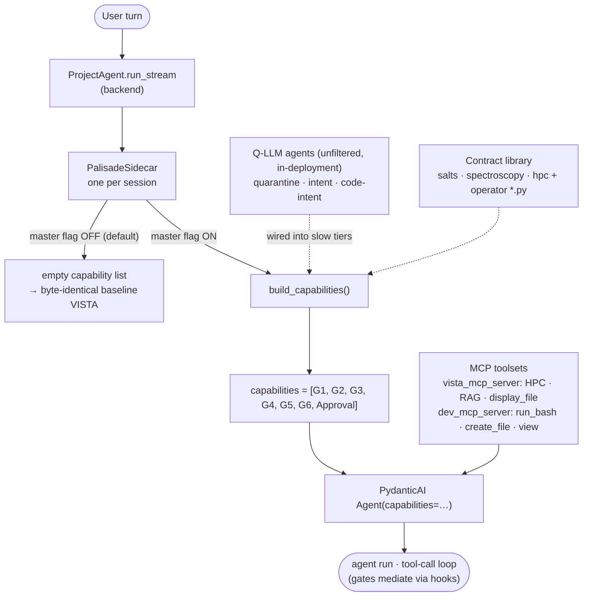
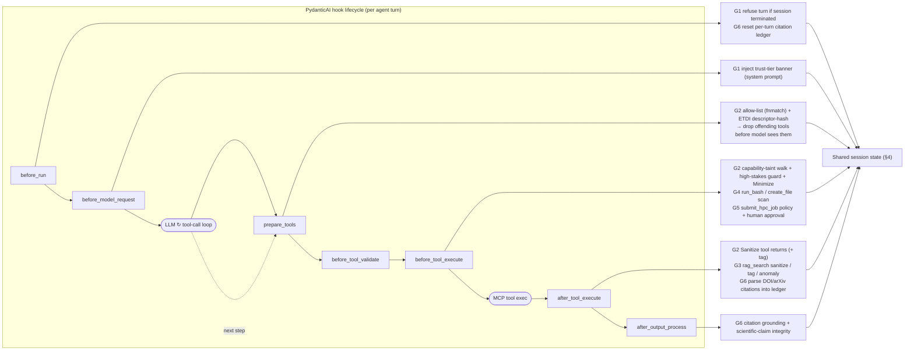
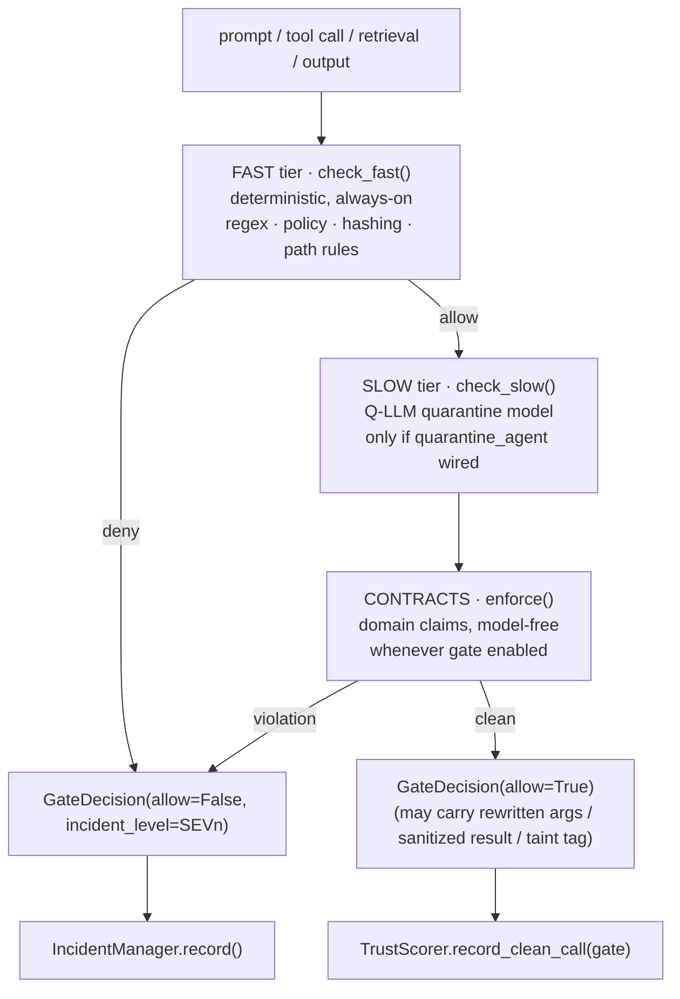
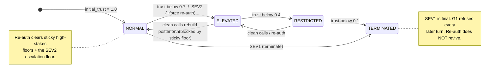
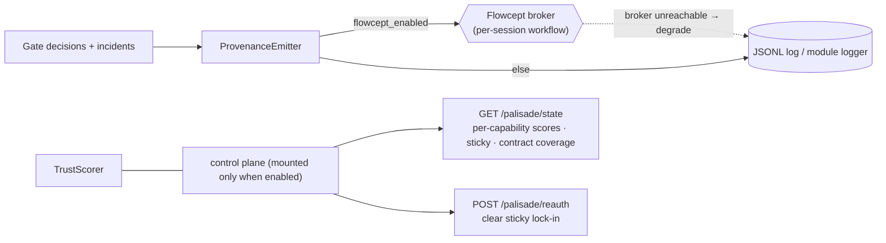
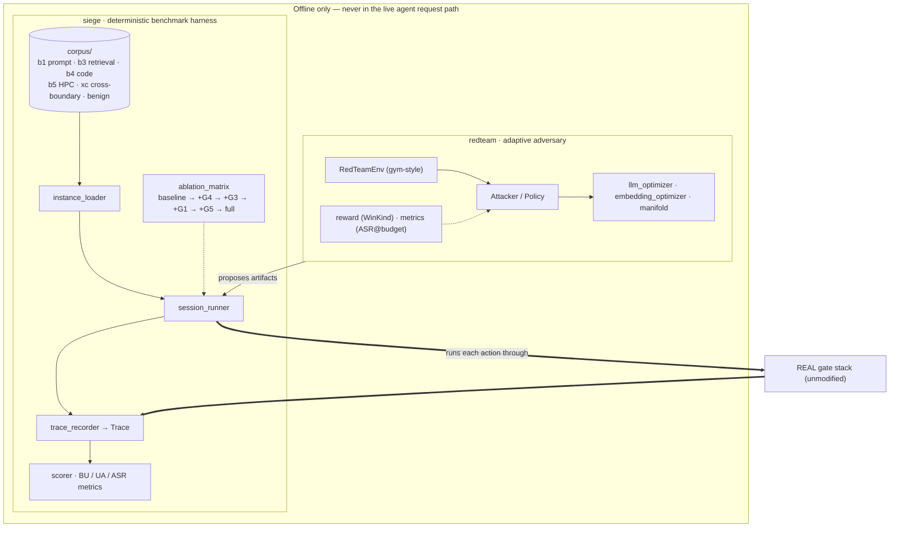

# PALISADE architecture

PALISADE is the security-mediation **sidecar** that wraps `ProjectAgent`'s
tool-call surface with a chain of fast-then-slow **gates**. It is a strictly
modular addition: with the master flag off (the default), `build_capabilities()`
returns an empty list and the agent is byte-identical to baseline VISTA.

The gates are exposed to the agent as PydanticAI `AbstractCapability` subclasses
(`G1PromptCapability`…`G6EgressCapability`) that register lifecycle **hooks**.
Each gate decides via a deterministic **fast tier**, an optional Q-LLM **slow
tier**, and a model-free domain **contract** check, then routes any incident
through a shared adaptive layer (trust scoring + incident playbook) and emits
provenance.

> Gate numbering note: the former **G7 sandbox gate is folded into G4** (one
> sandbox/code boundary). `g7_enabled` is deprecated and aliases `g4_enabled`.

---

## 1. System context & integration

How the sidecar plugs into the agent. The Q-LLM agents and MCP toolsets are
threaded in at build time; the master flag gates the entire thing.

---

## 2. Runtime hook lifecycle → gate actions

The spine is PydanticAI's per-turn hook lifecycle. Each hook fires the gate(s)
that registered on it. A fast-tier deny raises `SkipToolExecution` /
`PalisadeDeny`; the deny message becomes the tool result (or refuses the turn).

---

## 3. Per-gate decision model (fast → slow → contracts)

Every gate runs the same three-stage cascade. The fast tier is always on; the
slow tier runs only when a `quarantine_agent` is wired (`quarantine_enabled`);
the contract check needs no model and runs whenever the gate is enabled.

### Gate reference

| Gate | Boundary | Fast tier (deterministic) | Slow tier / contracts | Key hooks |
|---|---|---|---|---|
| **G1 Prompt** | B1 prompt injection | jailbreak signatures, PII / CUI markers, upload MIME + size | Q-LLM intent self-consistency; **SEV1 → terminate session** | `before_run`, `before_model_request` |
| **G2 Tool** | B2 tool surface | allow-list (fnmatch), ETDI descriptor hash (rug-pull), JSON-Schema, capability-taint + high-stakes | Minimize (strip args) + Sanitize (returns) | `prepare_tools`, `before_tool_validate`, `before_tool_execute`, `after_tool_execute` |
| **G3 RAG / Memory** | B3 retrieval | query-injection regex, per-chunk tag, embedding-cluster anomaly (z-score), hybrid BM25+vector | Q-LLM chunk intent + domain contracts over claims | `before_tool_execute` (inject hybrid), `after_tool_execute` (`rag_search`) |
| **G4 Sandbox / Code** | B4 code (← G7) | Tier-0 path confinement + execution IOCs; Tier-1 Semgrep (optional) | Q-LLM code-intent | `before_tool_execute` (`run_bash`, `create_file`) |
| **G5 HPC Job** | B5 HPC | allocation policy + resource ceilings, mining-binary denylist, SLURM parse | chained-job DAG walk + HPC contracts; human approval | `before_tool_execute` (`submit_hpc_job`) |
| **G6 Egress** | output integrity | citation grounding (DOI / arXiv), scientific-value claims via contracts | annotate (default) or block (`ModelRetry`) | `before_run`, `after_tool_execute` (`rag_search`), `after_output_process` |

---

## 4. Adaptive layer — trust, incidents, sticky high-stakes

Incidents feed a **per-capability** Bayesian trust scorer (independent `Beta`
posteriors, so a clean stream of G2 calls can't wash out a G3 breach). The
session tier is the **worst** capability tier, clamped by the incident floor.

**Incident playbook (`IncidentManager` → `TrustScorer.notify_incident`):**

| Severity | Log level | Action |
|---|---|---|
| **SEV3** | INFO | scoring only, no tier change |
| **SEV2** | WARNING | elevate session tier + force re-authentication |
| **SEV1** | ERROR | terminate session (every further turn refused) |

**Sticky high-stakes** (`sticky_high_stakes=true`): a high-stakes denial
(G5-above-ceiling, G6-destructive, G3-CUI) ratchets a per-capability floor that
clean calls can't lift — only explicit re-auth clears it. This breaks the
probe-then-strike oscillation primitive.

Shared session state lives on the sidecar, not the LLM context:
`CapabilityRegistry` (taint tags: sensitivity / dual-use / provenance chain),
`TrustScorer`, `IncidentManager`.

---

## 5. Provenance & control plane

Supporting utilities (live runtime, outside the gate cascade):
`tool_registry.py` (ETDI schema pinning for G2), `ingestion.py` (upload
deny-list, pre-sandbox), `provenance_manifest.py` (tamper-resistant upload
audit), `quarantine.py` (Q-LLM agent builder).

---

## 6. Offline evaluation & red-teaming

These subsystems are **not in the live request path**. They drive authored
attack sequences through the *real, unmodified* gate stack to measure it.

| Attack class | Boundary |
|---|---|
| `b1_*` | B1 prompt injection (direct, crescendo, obfuscation, suffix, dual-use framing, …) |
| `b3_*` | B3 retrieval (corpus / embedding / data-value poisoning, citation forgery, tool-return injection, …) |
| `b4_*` | B4 code (malicious code, network exfil, typo-squat, path traversal, …) |
| `b5_*` | B5 HPC (mining, credential exfil, SLURM smuggling, DAG escalation, …) |
| `xc_*` | cross-boundary chains (taint laundering, runtime supply chain, history forgery, …) |
| `benign_workload` | non-attack control |

---

## Configuration quick-reference

All under `Settings.palisade`, overridable via
`PALISADE_<FIELD>` (double underscore = nested). Everything
defaults **off / minimal**.

| Flag | Default | Effect |
|---|---|---|
| `ENABLED` | `false` | master toggle; off → every hook is a no-op |
| `G1_ENABLED` … `G6_ENABLED` | `false` | per-gate toggles |
| `QUARANTINE_ENABLED` | `false` | master slow-tier toggle (Q-LLM) |
| `QUARANTINE_MODEL` | `openai:gpt-oss-120b` | Q-LLM model spec; an unfiltered, in-deployment endpoint (CUI never leaves) |
| `STICKY_HIGH_STAKES` | `true` | high-stakes denials don't auto-recover within a session |
| `SEMGREP_ENABLED` | `false` | G4 Tier-1 Semgrep scan |
| `CONTRACTS_DIR` | `../palisade_contracts` | operator contract directory |
| `FLOWCEPT_ENABLED` / `FLOWCEPT_ENDPOINT` | `false` / `null` | ship provenance to a Flowcept broker |
